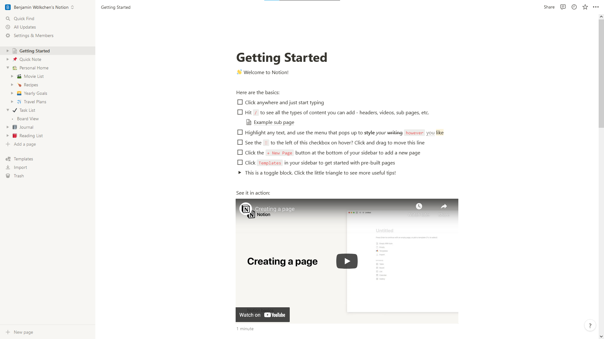
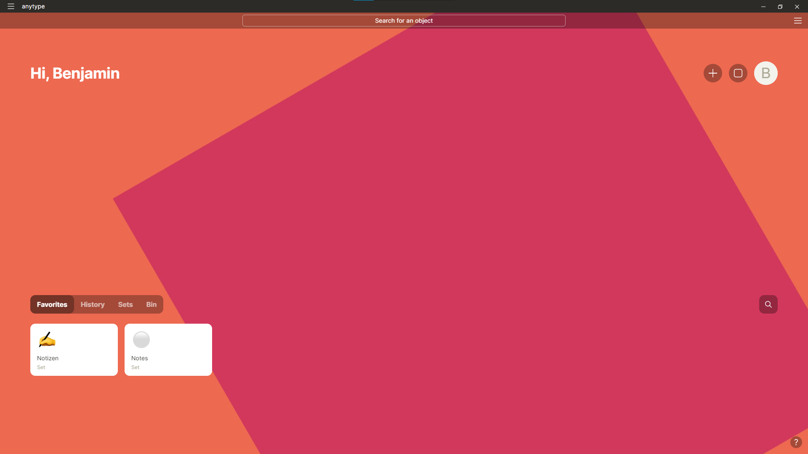
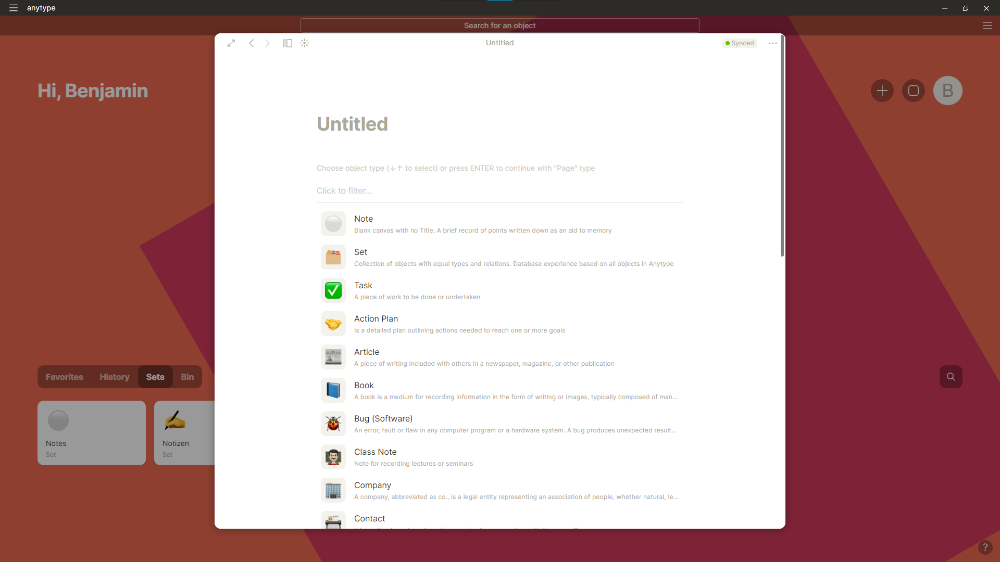
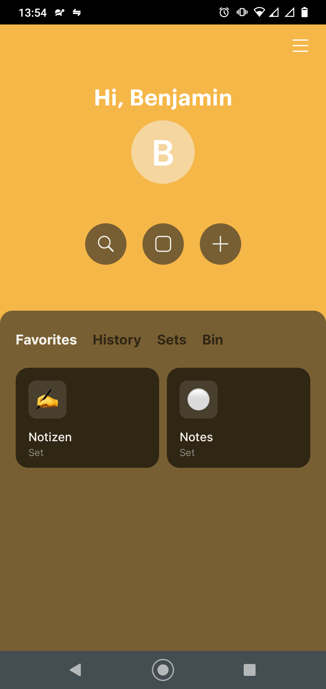

After Evernote restricted the number of devices you could use with the free plan, I moved over to Notion.
Notion isn't just a simple note taking app with independent documents, its a big database, where every note can connect to other notes making it easy to sort things into categories.

I've used Notion for a long time, but after I really got into privacy, I started to search for a encrypted alternative.
I wasn't comfortable anymore with organising my entire life in one central, unencrypted place owned by some coorporation.

So, I started to search for an alternative.
I eventually found Anytype, but it was invite only, so I couldn't try it yet.

I moved on and started using StandardNotes. I still use it today and I am pretty happy with it.

Now I got access to the [Anytype alpha](https://anytype.io) and wanted to write about it here.

When you launch Anytype for the first time, you are greeted with a [seed phrase](https://www.coinbase.com/de/learn/crypto-basics/what-is-a-seed-phrase) that secures your private key.

After you save that key and proceed, you get to your homescreen.

On the homescreen, you can create new sets using pre-build templates using the plus button on the top right.

Your anytype "account" is encrypted using a private key that is protected by your seedphrase and it is synced using IPFS.

Because of that, you can also use Anytype on your Smartphone:

One thing I noticed with the desktop app is that is always launches in full-screen mode and it feels kinda sluggish.
I probably won't continue to use it for now, but we'll see how Anytype evolves.

* * *
## Comments
