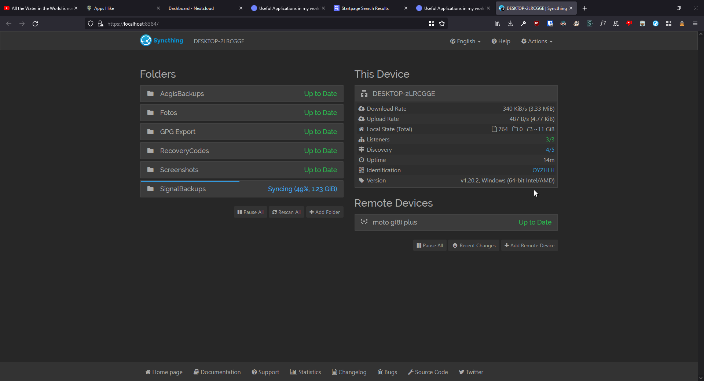
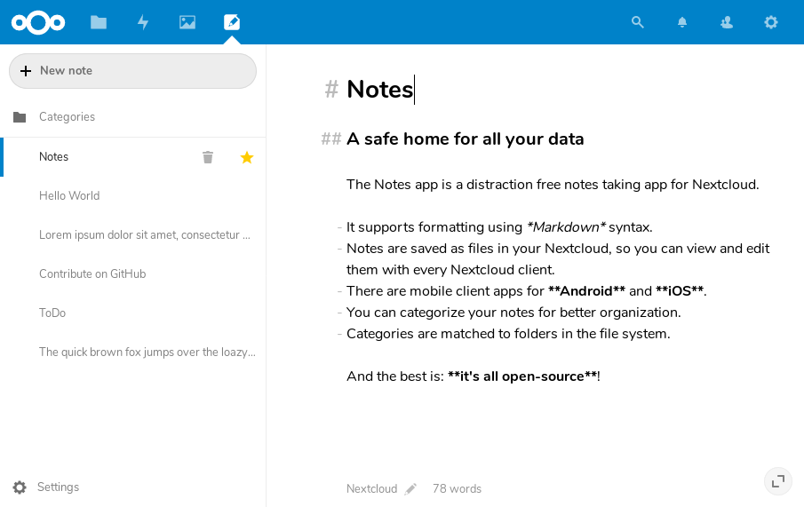
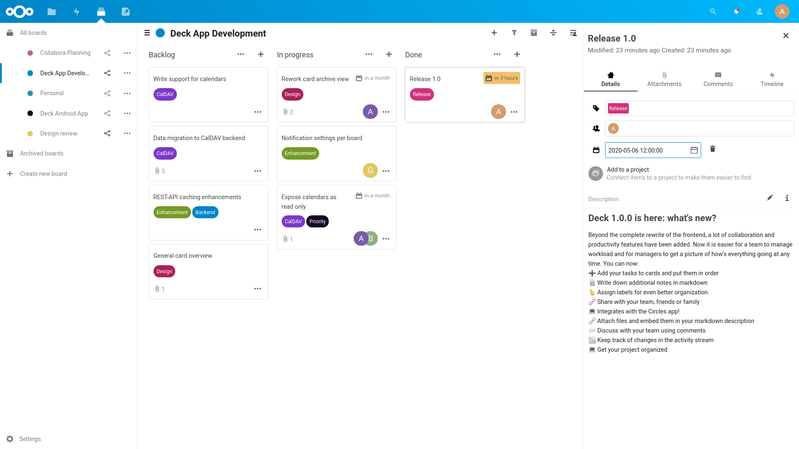

Both on my phone and on my laptop I have around 100 applications installed.
Today I want to talk about some of them, that I use daily and that keep me productive.

* * * 
This are only a select few of the applications I use.
Maybe I'll do a proper "Uses"-Page later... We'll see.

## Spotify
I know, it's bad.

I am part of a family subscription that we share in the family, so I use it.
I've liked Spotify for discovering new music. For that, it is a really great service.

Still, the subscription aspect of it bugs me. I thought of setting up [Jellyfin](https://jellyfin.org/) or something similar on a Raspberry Pi and using that.

But as long as I have this subscription, I'll use it. *And I'll use it,* like come in my room at random times: Music plays.

## FairEmail
I have many different mail accounts for different purposes.
My main (private) one is on disroot.

I love that I can use all of those accounts in [FairEmail](https://email.faircode.eu/) without getting shown ads or annoying "Emails are getting synchronized" notifications, without any new emails.

*I know, by default there is a notification that stays there forever, but you can easily hide it.*

The interface is simple but beautiful and adding accounts was a breeze.

## Bitwarden
I used to use the same password on all of my accounts. Simple and convinient.
**But not secure.**

I used to use a KeePassXC + Syncthing Combo, but it was draining my battery, so I looked for a alternative.

I've found [Bitwarden](https://bitwarden.com/), and I've loved it ever since.

The UI is the most clean I've ever seen on a password manager, the feature set is mature and it supports basically every device type out there.

And of course, it's open source. Which isn't just an added plus, it's a must for a security relevant application.

## Syncthing
I use [Syncthing](https://syncthing.net/) to backup my photos from my phone to my laptop, and I also use it to sync the Signal Backups to my laptop.



Syncthing is the first cornerstone in my backup strategy. *Syncthing alone is never a backup.*

On my Phone I use [Syncthing-Fork](https://f-droid.org/en/packages/com.github.catfriend1.syncthingandroid/) from F-Droid that includes battery optimizations and other fixes.

On my Laptop I use [SyncTrayzor](https://github.com/canton7/SyncTrayzor), to have Syncthing always in the System tray and features like showing sync status in the tray.

## rclone
Now that I have all my backups on my laptop, I need one offsite backup.
For that I use [rclone](https://rclone.org).

rclone is a really simple to configure command line utility, that makes (encrypted) cloud backups easy.

To backup everything to Google Drive, I just need to type the following command:
```bash
$ rclone sync ./Backups/ DriveCrypt:Backups -P
```

After waiting a bunch, everything is ~~save~~ backed up on Googles computers.

## Nextcloud Notes
I've used Standard Notes before, but now that I have my own Nextcloud Server (powered by [Stuxhost](https://stuxhost.com), it's awesome ❤) I use [Nextcloud Notes](https://apps.nextcloud.com/apps/notes).



The notes are just simple Markdown or Textfiles that are stored on your Nextcloud.
They are all organized in the `/Notes` Subdirectory, so you can download them at any time.

The cool thing is, if you add tag to your note, it gets moved into the specific folder for that tag.
For example you have notes full of cat pictures and now you wanna organize them.

If you add the tag 'cat' to all of them they will be moved to `/Notes/cat/`.
Even if you edit the files with something different than Nextcloud Notes, the structure will still be there.

On my phone I use the [Nextcloud Notes App](https://f-droid.org/en/packages/it.niedermann.owncloud.notes) availiable from F-Droid.

## Nextcloud Deck
For organizing projects, I use [Nextcloud Deck](https://apps.nextcloud.com/apps/deck).



I like having all the tasks in front of me. I can add attatchments, write notes and plan out further.
Sometimes I use it as a personal to-do list.

On my phone, I have the [Deck App](https://f-droid.org/en/packages/it.niedermann.nextcloud.deck) installed.
## [Simple Gallery]()
By default my phone uses Google Photos, which is terrible since it buried the folder view somewhere deep in the app.

I've always been a fan of the [SimpleMobileTools](https://simplemobiletools.com), so I insalled [Simple Gallery Pro]() from F-Droid, and I've been happy ever since.
## Aegis
**Always, always use 2FA.**

And incidentally the first recommendation that gets pushed onto us is Google Authenticator.

~~It's fine.~~ You know what, no it isn't. It lacks basic features. Like the ability to backup your keys or lock the app with a pin.

And as a security related app it isn't open source (anymore).

So after some digging, I found [Aegis](https://getaegis.app). It's open source, supports locking the app with fingerprint or pin, exporting data and it supports import 2FA data from a wide range of apps.

My favorite feature are the icon packs, so you can see - without reading - which entry belongs to which app.

## Wrapping up
That were some of my favourite apps - or at least the ones I daily.

How does your list look like?