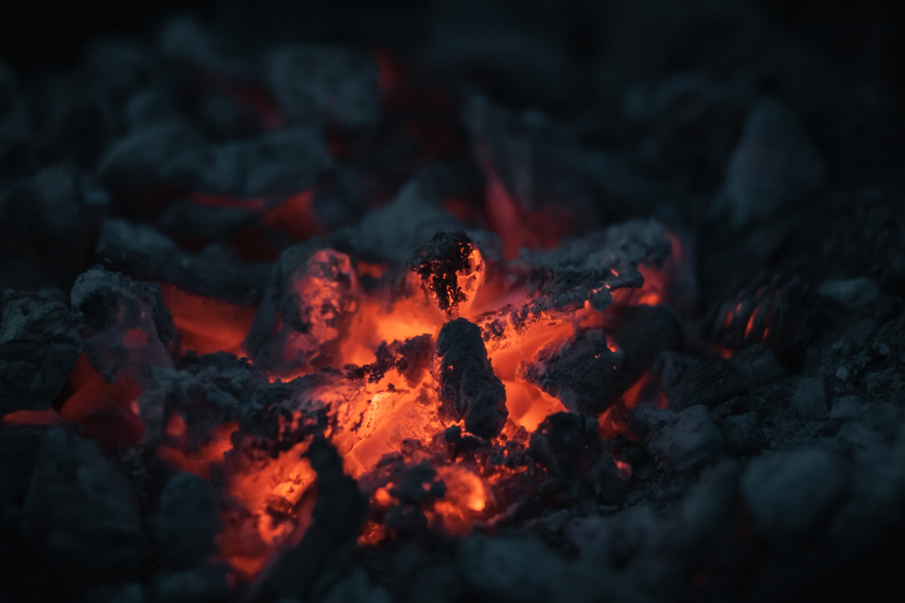

In my head, there is this picture of the christian that burns for Jesus.
The christian that regularly prays, reads the bible and has a connection with God.

I've felt like, I was getting further and further away from that. That hurt.

But I was allowed to notice that this flame, that once burned inside me, hasn't gone out.

I was allowed to notice, it doesn't matter how far I move away from God: This flame will *never* go out.

God hugs me with all his love and power and he will never let me go.

> He's making diamonds out of us.
~ Hawk Nelson

Sometimes my live feels like ashes. Everything burns to the ground.

Did you know that Diamonds are the most sturdy mineral currently known?
Do you know how Diamonds are made?

Diamonds are made out of ashes. They're made by compressing the ashes really strong.

And he's making Diamonds out of us, all the challenges that we face, all the broken things in our life are the process of us becoming a beautiful and sturdy Diamond. ❤💎