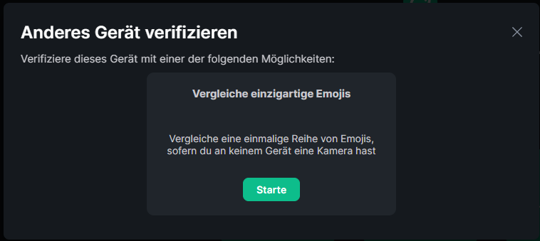

Vielleicht hast du von so genannten dezentralen Messengern gehört und willst wissen, was es damit auf sich hat, oder du hast eine dieser Messenger Vergleichstabellen gesehen, oder vielleicht hat dich dein Freund hier hin geschickt.

## Was ist Matrix denn jetzt?
Matrix ist ein Protokoll für Instant Messaging, ähnlich wie E-Mail ein Protokoll für Business Kommunikation ist.
Genau wie E-Mail ist Matrix *nur ein Protokoll*. Und genau wie E-Mail kannst du dir aussuchen bei welchem Anbieter - oder wie es bei Matrix genannt wird *Homeserver* - du dich registrierst.

Deine Nachrichten reisen von deinem Homeserver zu dem Homeserver des Empfängers, **genau wie Email.**

Der Vorteil das so zu machen ist - selbst wenn ein Server down geht - kann die Unterhaltung zwischen allen anderen Teilnehmern ganz normal weiter gehen. 

## Erste Schritte
Um zu beginnen, musst du dir aussuchen, welche App du benutzen möchtest um auf deinen Account und deine Nachrichten zuzugreifen.

### Einen Homeserver wählen
Für diese Demo werde ich ``matrix.org`` als meinen Homeserver benutzen. Du solltest dir aber einen Server aussuchen der dir gefällt. Sei es, weil die Domain cool ist, oder weil der Server bei dir in der Nähe steht.

Ein guter Einstieg ist [diese Liste](https://joinmatrix.org/servers/)

### Einen Client auswählen
Jetzt wo du dir einen Homeserver ausgesucht hast, musst du dir den Client - die App die du installierst - aussuchen.

Der Client den du wählst, beeinflusst das Look and Feel von Matrix.

Für den Einstieg empfehle ich [Element](https://element.io/getting-started) oder wenn du eine traditionellere Erfahrung haben willst, [SchildiChat](https://schildi.chat).

### Registrieren & Konto einrichten
In dieser Demo werde ich Element als meinen Client verwenden.

Nachdem du den Client geöffnet, und auf "Konto erstellen" geklickt hast, siehst du diesen Bildschirm:

  
Wenn du deinen Account auf einem anderen Homeserver als ``matrix.org`` erstellen möchtest, klicke auf den "Bearbeiten"-Button neben ``matrix.org``.

In dem Fenster kannst du den Homeserver deiner Wahl eingeben, und mit einem Klick auf "Fortfahren" bestätigen.

Gib deinen Benutzernamen, ein Passwort und optional deine E-Mail ein. Anschließend klicke auf Registrieren.

Abhängig von deinem Homeserver hast du jetzt eine E-Mail bekommen, mit der du deinen Account bestätigen musst.

Sobald du registriert bist, gehe zurück zu dem Client und melde dich an.

**Du bist fast fertig. Du könntest jetzt schon anfangen Nachrichten zu schreiben.**

## Die letzten Einstellungen treffen
### Schlüssel Backup
Obwohl du jetzt schon anfangen könntest, Nachrichten zu schreiben, gibt es noch ein paar Dinge die man noch einstellen kann.

Nachrichten in Matrix sind standardmäßig Ende-zu-Ende-Verschlüsselt und weil du nicht deinen Schlüssel für jeden einzelnen Chat merken willst gibt es Schlüssel Backups.

Um Schlüssel Backups zu aktivieren, klicke auf dein Profilbild und dann auf "Sicherheit".

Oben siehst du eine Liste mit allen Geräten auf denen du angemeldet bist. Da drunter ist ein Abschnitt "Verschlüsselung" mit der Option "Sicheres Backup".

Klicke auf den "Einrichten"-Button unter der "Sicheres Backup" Überschrift.

Element fragt dich jetzt, ob du ein Sicherheitsschlüssel generieren möchtest, oder ob du eine Sicherheitsphrase verwenden möchtest. 

Ich empfehle den Sicherheitsschlüssel.

Auf dem nächsten Bildschirm siehst du dann den Sicherheitschlüssel - eine lange Zeichenkette.

Schreib sie auf. Auf einem *echten* Stück Papier. Wenn du den Sicherheitschlüssel verlierst sind auch deine Nachrichtenverläufe weg.

Klicke noch einmal auf "Fortfahren" um das Schlüssel Backup vollständig einzurichten. 

## Cross Signing und Multi-Device Support
Wenn du dich jetzt auf einem neuen Gerät anmeldest, wirst du auf dem ersten Gerät gebeten, diese Sitzung zu verifizieren.

Dort hast du die möglichkeit, deine Sitzung mit einem anderen Gerät oder mit einem Key Backup zu verifizieren.

Bei der Überprüfung mit einem Key-Backup wirst du aufgefordert, den Key Backup-Code einzugeben, der generiert oder im letzten Kapitel ausgewählt wurde.

Aber ich empfehle das verifizieren mit einem anderen Gerät. 
But I recommend verifying with another device. This will cause a "Verification requested" prompt to appear on one of your devices.

 
Auf einem deiner Geräte, klicke auf "Vergleiche einzigartige Emojis".

Dadurch wird eine Emoji-Sequenz generiert, die auf beiden Geräten identisch sein sollte. Wenn sie übereinstimmt, klicke auf "Sie stimmen überein" auf Ihren Geräten.

Jetzt ist die zweite Sitzung verifiziert. Es werden die Verschlüsselungsschlüssel aus der ersten Sitzung importiert und alle Chats sollten angezeigt werden.

Als Einstieg kannst du ja mal versuchen, mir zu schreiben - [@benjamin:mstdn.social](https://matrix.to/#/@benjamin:mstdn.social).

* * *

P.S.: Dieser Leitfaden ist unter [CC BY-SA 4.0](https://creativecommons.org/licenses/by-sa/4.0/) veröffentlicht, wenn du ihn also übersetzen oder weitergeben möchtest, würde mir das sehr viel bedeuten ☺.

P.P.S: Die Kommentare in diesem Blog unterstützen auch Matrix. Versuch doch mal, mit deinem Konto zu kommentieren.
