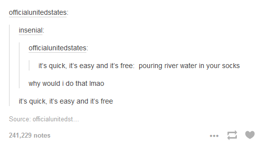

I think everyone should have a blog, let me expain why.
* * *
## Processing thoughts
I started writing down my thoughts on the internet in 2016. (That's six years ago already 🤯)
Back then, it was mostly thoughts about faith and my life with God. (I [still do that](https://awesomebible.de), it's german though.)

This blog helped me process my thoughts and emotions.

I now started this blog to write down more tech related thoughts and experiment a little with [Hugo](https://gohugo.io).

## Learn new skills
The second reason why I think, everyone should blog is to learn new skills.
This blog helped me become familiar with [Hugo](https://gohugo.io).

The other side of the coin is, to document things and essentially help others learn new things.

I've kind of noticed a pattern with me searching for stuff online. If I need a software for a niche use case, or need a solution to a problem, most of the time, I find the solution on a blog.

Of course, there are forums too, but often the blogpost about something has more detail.

## Having a knowledgebase
You can't imagine how helpful it is, to have a knowledgebase of things that you otherwise would have to lookup again and again.
This basically goes for every subject and field of work, not only tech.

## It's quick, it's easy and it's free!

Spinning up this blog with hugo took me like 30 minutes. And writing a post is nothing more than writing it and clicking one button to deploy it.

And if you use something like [Forestry](https://forestry.io) - which is a great product - you can reduce the 30 minutes to something like 5 minutes. I also got my domain for free, from [Freenom](https://freenom.com) and my blog is deployed using [Netlify](https://netlify.com)'s free tier.

It's literally just a click of a button - so what's your excuse not to do it?
Maybe start with something like [#100DaysToOffload](https://100daystooffload.com/), to give yourself an incentive to keep going.

In reality, you don't have to blog every day or even every week. Just every time you come across something cool, or something you want to document.

### Microblogging
There's one thing I haven't touched on in this post, and that is Microblogging.
If long-form content isn't particularly your style, maybe consider joining a [Mastodon](https://joinmastodon.org/) or [Misskey](https://join.misskey.page) instance and using that as your blogging platform.

**Just start blogging.**