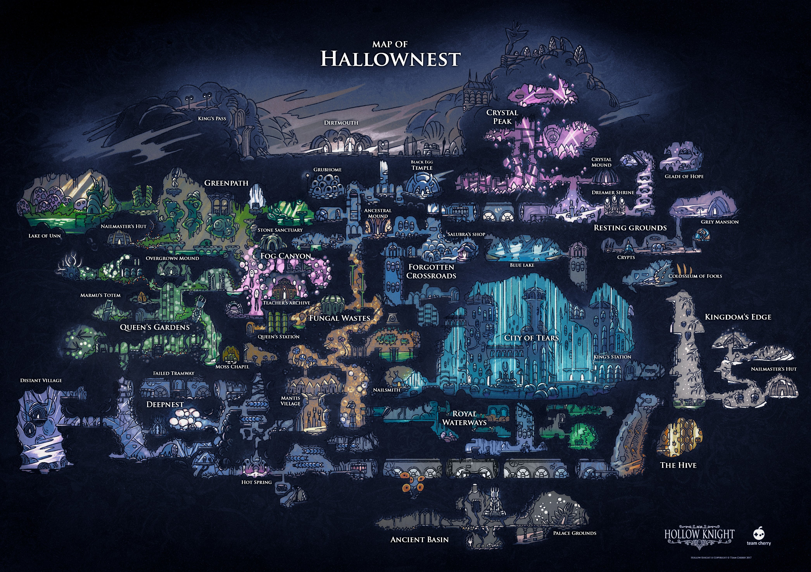

We did Secret Santa on Christmas with my family and the gift I got was Hollow Knight.
Usually I don't play much video games and when I do, it's either Mario Kart, Mario Party or Super Smash Bros with friends and maybe the occasional Pokémon.

All the platformers I've played up to that point were pretty linear, with levels, and a clear path to follow. So it was a pretty new experience playing Hollow Knight for the first time.

Hollow Knight starts out with a short cutscene explaining how the Knight (you), got where he is and then jumps right into the game.

It's an empty room with an exit to the right. No music is playing, only amient sounds like wind and the dripping of water in a cave.
This sets the theme for the game perfectly. You don't know why you're there and the only thing you can do is explore.

The first "real" room you enter contains one enemy and a small platforming section:

You've only really got one way to go: To the top.

It won't stay quiet for long though: The moment you enter the first real region of the game, the silence fades and a [beautiful piano track](https://piped.adminforge.de/watch?v=NSlkW1fFkyo&list=PLmOldskd2VbL7_t-NE9p6rEboq_v0AHko&index=2) starts playing.

In the first few minutes of the game, you get to know the people (or bugs and insects) that make up the world of Hollow Knight.
The second you enter the first cave, you hear [another relly beautiful soundtrack](https://piped.adminforge.de/watch?v=eX4de4BH5lM&list=PLmOldskd2VbL7_t-NE9p6rEboq_v0AHko&index=3).

I won't spoiler any early game interactions here, but my point is: The moment I discovered the Mapbug - Cornifer - I *really* fell in love with the game.
I decided to not look up anything about the game - and I encourage you to do the same if you want to play it sometime in the future. It's worth it dicovering every little bit for yourself.
And there is **a lot** to discover:

Hollow Knight was a stark contrast to the games I've usually played, and my fear was that I would never complete it, because I would get lost and then lose interest.

The game is pretty straight forward to the player: It creates an atmosphere of being lost in the first few seconds of the game.
But I think this set of expectation makes or breaks such games. If the game would hold my hand in the beginning and then be like: "Now you're on your own", I probably get lost really quickly and lose motivation.

But Hollow Knight is different. The games developers - Team Cherry - are masters of creating atmosphere and the first atmosphere they portray is loneliness.
This change makes it so, that I don't lose interest. On the contrary: This loneliness sparks my curiosity and I want to explore.

The game tells me: "It's okay to get lost."
But it also gives me a guide with the ingame map, so that I don't get frustrated when I get lost.

Hollow Knight achives this balance holding the hand of the player and letting them get lost. Hollow Knight makes being lost fun.

Entering a new area or finding a new boss is always so rewarding because you've spent hours exploring and finding it.

Honestly, I don't know where I'm going with this, so my conclusion for this post is the following:

Go buy [Hollow Knight](https://www.hollowknight.com/), it's more than worth the [15 bucks that is costs](https://www.humblebundle.com/store/hollow-knight). And I'd like to express my eternal gatitude to my sister who bought me this game. Thank you, it was the best purchase you could have made. ♥️

* * *

It also runs on Arch, btw. 