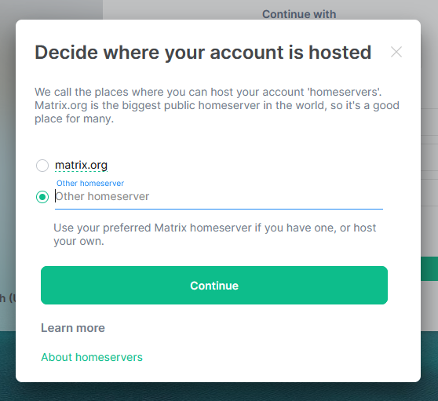
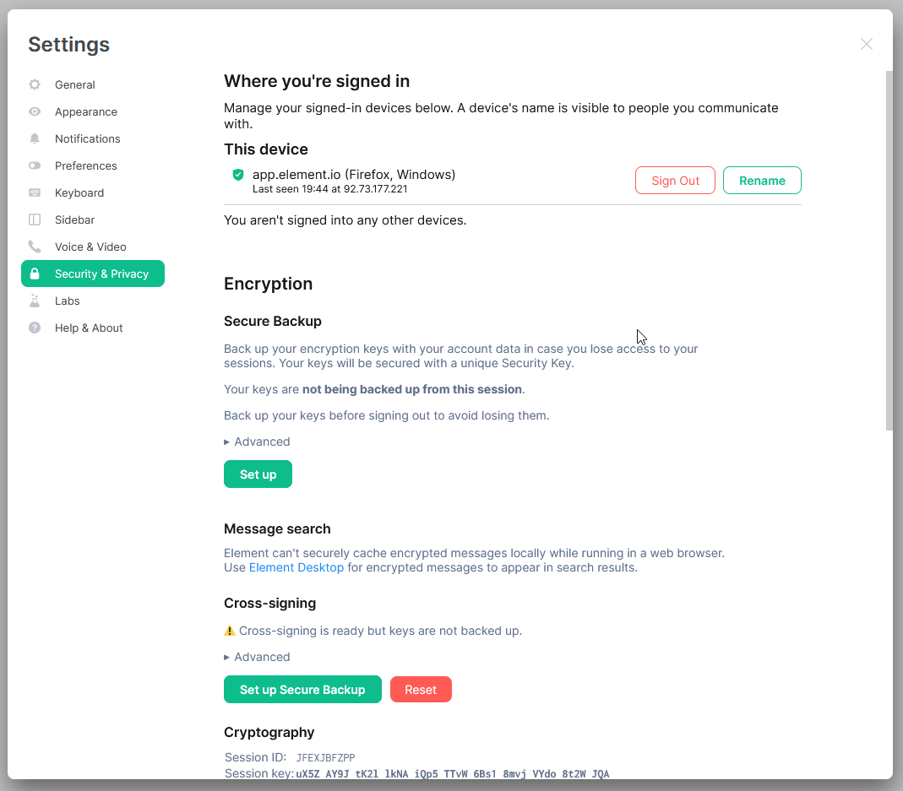
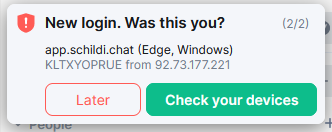
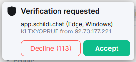
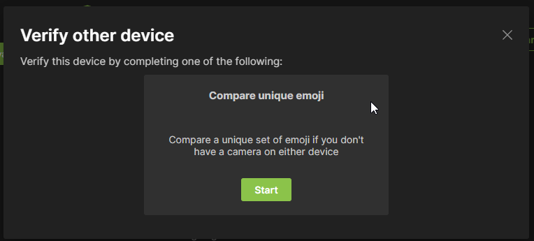
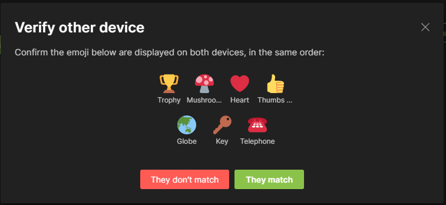

Maybe you have heard of so-called decentralized messengers and want to know what the fuzz is about, or you have seen one of those messenger comparison charts, or maybe, your friend send you here.

## So, what is Matrix now?
Matrix is a protocol for instant messaging, just like email for business communication.
Just like email, Matrix is *just a protocol*. And just like email, you can choose which provider - or in Matrix terminology *homeserver* you sign up on.

Your messages travel from your homeserver to the homeserver of your recipient, **just like email.**

The advantage of this way of doing things is, that even if one server goes down, the conversation can continue normally for all other parties.

## Getting started
To begin, you have to choose the app you want to use, to access your account and your homeserver.

### Choosing a homeserver
For this demo, I will use matrix.org as my homeserver, but you should choose a server that you like.
Maybe because it is located close to you, it aligns with your interest, has reliable uptime, or it just has a cool domain name.

As a starting point, I recommend [this list](https://joinmatrix.org/servers/) to choose from.

### Choosing a client
Now that you've chosen your homeserver, you need to choose the client - or the app that you install.

The client you choose affects the look and feel of Matrix.
For getting started, I recommend [Element](https://element.io/getting-started) if you want a Discord-like experience, or [SchildiChat](https://schildi.chat/) for a more traditional WhatsApp-like experience.

### Signing up & configuring your account
In this demo, I will use Element as my client.

After you opened your client and clicked on "Sign up", you will see this screen:

  
If you want to create your account on a different homeserver than matrix.org, you can click on the "Edit" Button next to matrix.org.

This window will pop up, asking you to enter your homeserver of choice. After you're done, click on continue.

Enter your username, your password and optionally an email. Then click on register to sign up.

Depending on your homeserver, you will have received a confirmation email, where you have to click on a link to continue.

Once you're registered, go back to the client and log in.

**Now you're set. You can start writing messages on Matrix.**

## Configuring the last bits
### Key Backup
Although you can start writing messages now, there are still a few things left to explore.

Messages in Matrix are end-to-end encrypted by default and because you don't want to memorize your encryption key for every chat that you start, Matrix has a feature called Key Backup.

To enable the feature, click on your profile picture and then on "Security & Privacy".

At the top, you can see all the devices where you are signed in, below that there is a section called "Encryption" with an option for a Secure Backup.

Click on the "Set up"-Button, below the "Secure Backup" heading.
This will prompt you to either generate a security key, or enter a security phrase.

I recommend the first one. 
On the next screen, you will see that security key - basically a long group of letters.

Write it down. On a *real* piece of paper. If you lose it, all your message history will be gone.

Click on continue one more time to finish setting up your key backup.

## Cross Signing and Multi-Device Support
If you now sign in on a new device, you will get a prompt to "verify this device".

There you have the option of verifying with another device, or with a key backup.

Verifying with a key backup will give you a prompt to enter the Key Backup Code that was generated or that you chose in the last chapter.

But I recommend verifying with another device. This will cause a "Verification requested" prompt to appear on one of your devices.

 
On one of your devices, click on "Verify using Emojis".

This will generate an emoji sequence, should be the same on both devices. If it is the same, click on "They match" on your devices.

Now, the second session is verified. It will import the encryption keys from the first one and all your chats should appear.

Great. Now for some actual chatting. 😛

As a starter, you can try messaging me at [@benjamin:mstdn.social](https://matrix.to/#/@benjamin:mstdn.social) and tell me how it went.

* * *

P.S: This guide is published under [CC BY-SA 4.0](https://creativecommons.org/licenses/by-sa/4.0/), so if you feel like translating or sharing it, it would mean a lot to me. ☺

P.P.S: The comments of this blog are powered by Matrix. Try commenting with your account.