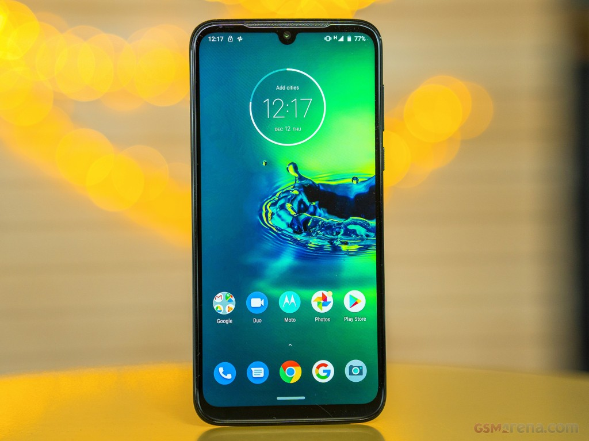
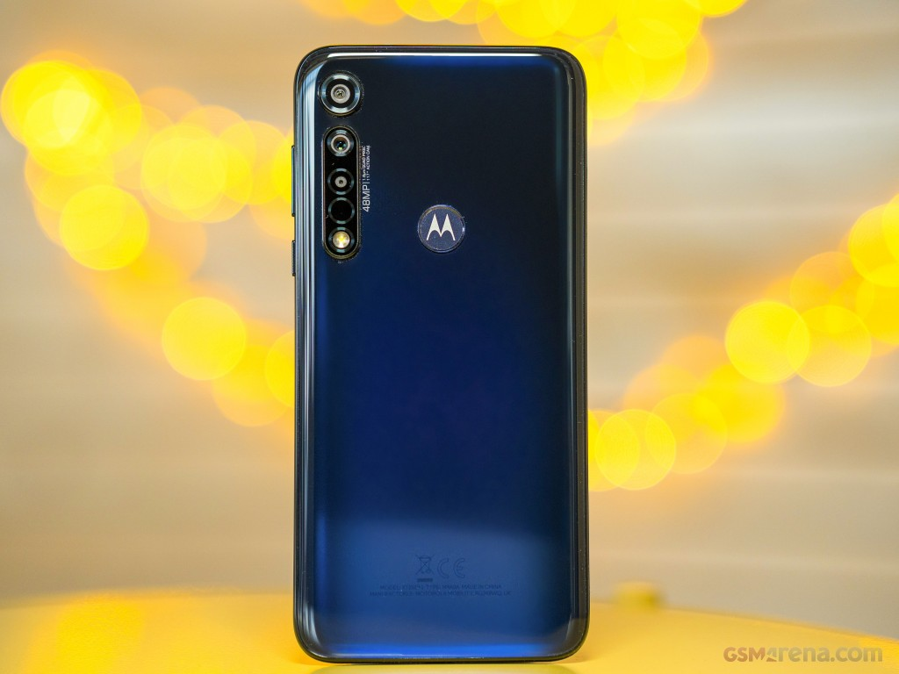
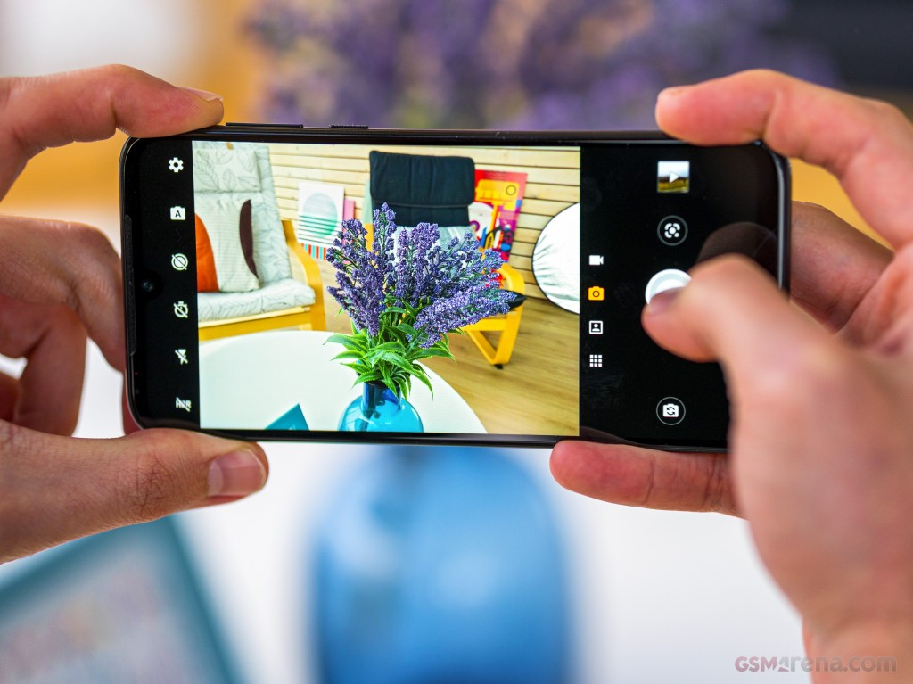

As you may have noticed, if you read my about page: I do hobby photography.
I started with it, because I always took photos in vacations and I noticed how much fun it was.

I don't own any fancy camera equipment, all the photos I take are taken with my phone.
For my phone, I use a Motorola Moto G8 Plus. It was like 290€ at the time I bought it (around 2019) and I'm happy with it since.
  
> [Images by GSMArena.com](https://www.gsmarena.com/motorola_moto_g8_plus-pictures-9916.php)

For the camera app, I use the stock app that came with the device. I like the experience, because you can customize the resolution of the images with a few clicks.
The camera app also offers a portrait mode, night mode and modes where you can key out the background or a specific color of an image.

You can find some of my photos on [Pixelfed](https://pixey.org/benjamin) - a photo sharing site based on ActivityPub - and maybe I will publish some of my photos on this blog someday. 🤷