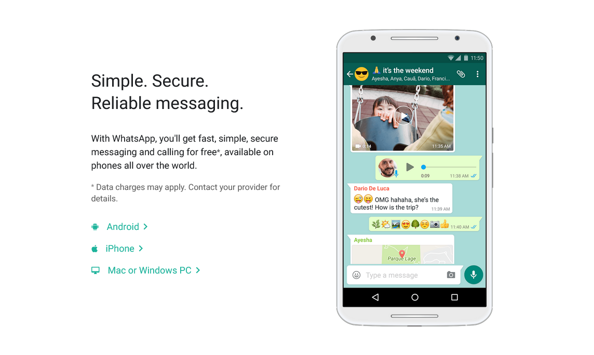
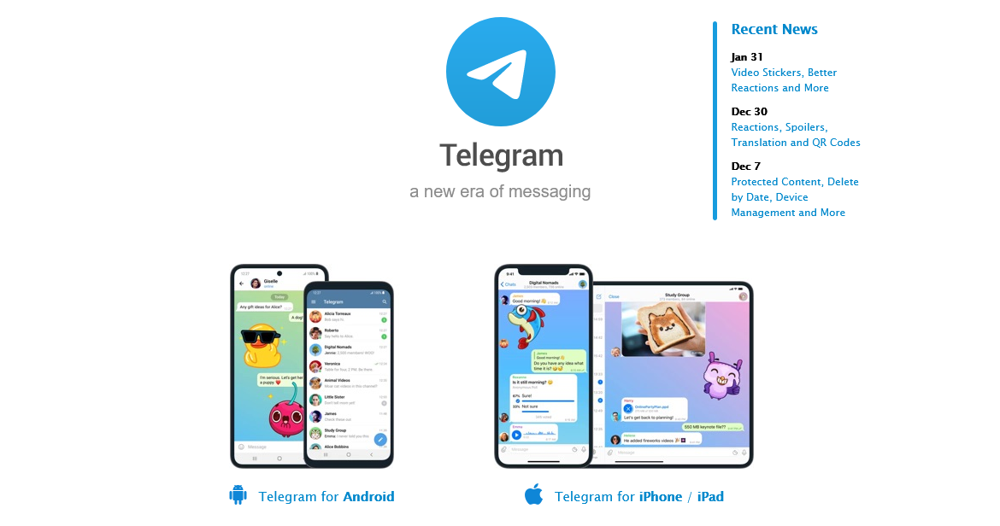
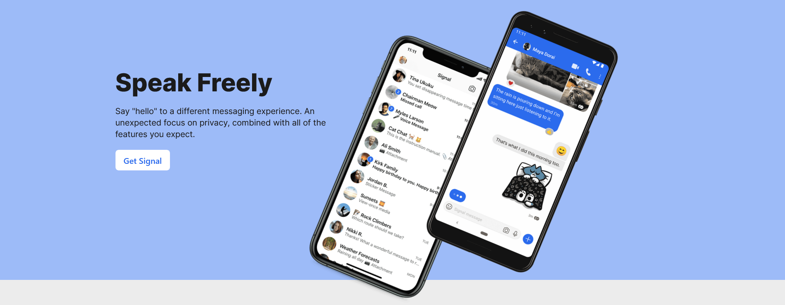
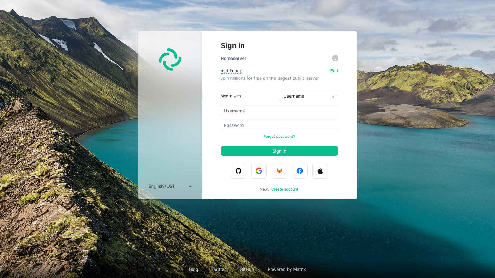

There are a plethora of messaging apps available to date.
I wanted to take a look at some good and some better ones.

## WhatsApp

I don't think I have to say much about this one.
WhatsApp is by far the most popular messaging app that ever existed, yet it is owned by one of the biggest companies that makes money by harvesting and selling people's data: Facebook (now Meta 😜)

WhatsApp is (in theory) end-to-end encrypted and perfectly secure. In the time it wasn't owned by Facebook, I would have belived it. In practice: No one except the engineers know.

WhatsApp has a major problem: It isn't open source.

## Telegam
After the privacy policy change in 2021 - WhatsApp started sharing data with it's parent and sister companies - many people have fled to alternative messaging providers like for example Telegram.

Telegram definitely *seems* better than WhatsApp, and it is.

Telegram isn't owned by a giant ad company, it doesn't share your data with anyone.
But it is also by far perfect.

It didn't really have any business model until recently. It was entirely paid out of the pocket of one of the founders.

The one thing that it has going for it, is that the [clients are open source](https://telegram.org/apps). Anyone can verify wether the messages are encrypted - and there the issues start.

By default chats are not encrypted. You have to start a "private chat" to get end-to-end encryption.
Groups and Channels can't be end-to-end encrypted. That makes sense for channels - because they are public - but not for group chats. I wouldn't like to have my entire family group chat open to anyone with access to the Telegram Servers.

One thing I noticed regarding "private" chats, is that Telegram doesn't support Cross-Signing for encryption keys. Moreover, private chats **aren't** supported in the Desktop or Web Clients.

## Signal
After the privacy policy change, my family and I transitioned to Signal for our family group chat.

Signal is pretty much the gold-standard for encrypted chats. Most people in my contact list switched from WhatsApp to Signal.
It finances itself entirely via donations. After the WhatsApp founder left the company, he donated 50 Million dollars to Signal.
Today, Signal is entirely powered by donations from it's users and people like Brian Acton.

Signal is a pretty good messaging app, but it still has it's criticisms.
The client and the server are both completely open source, but not available on F-Droid.
Signal also recieved heavy criticisms for implementing a MobileCoin wallet into the app.

One problem that all "mainstream" messaging apps have is centralisation.
WhatsApp users experienced this first hand with the "big Facebook" outage, where every single Facebook service was down for a few long hours.

Signal users also aren't immune to outages, as Signal had struggles to keep up with the big user growth, they also [faced an outage](https://twitter.com/signalapp/status/1350118809860886528) that lasted a whole day in some regions.

## XMPP
Fight me, but I don't really like XMPP.
I've never developed a client for it and only have experience with it on the user side of things, but the clients aren't my fit.

They don't look that modern and are missing features.

XMPP isn't a bad protocol by any means, so if you wanna try it out: https://xmpp.org/

## Matrix
Matrix is an open protocol just like XMPP.
The spec is maintained by the Matrix foundation.

Matrix solves a lot of problems "mainstream" messagers have.
It isn't owned by a big tech/ad company, it is able to encrypt all messages and groups and it is decentralized, protecting from a huge impact when outages hit.

Matrix is kind of split into two companies.

The first one is the Matrix Foundation: it manages the spec and everything around it.

The second company is Element (or New Vector LLC): It builds the Matrix Client "Element" and provides hosting for matrix.org and anyone who wants a server (through Element Matrix Services).

One more special thing the Matrix Ecosystem has are Bridges.
Bridges are programs that you install on your homeserver and through those bridges you can chat with *a lot* of other chat apps including Signal, Telegram and WhatsApp.

My favourite messenger is definitly Matrix.