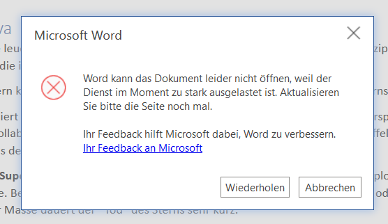

Inspired by [this post](https://joelchrono12.ml/blog/handwritten-homework/) from joelchrono12 I wanted to talk about my experience with the digital lessons that my school provides and just the state of digitization in general.

## What things does my school use
For video conferencing and literally **everything** else, my schools uses Microsoft Teams.
They went all in on the Office 365 Suite pretty early on.

In the first lockdown that we had here, the teachers would give us tasks via Teams Tasks that we could turn in directly on the platform.

My school also deployed digital whiteboards from [ProWise](https://www.prowise.com/en/prowise-touchscreen-ten/).

Now, after the lockdowns we got laptops for school use. (Really *only* school use. You can't even change the wallpaper.) We use them to take notes in OneNote for example.

## The problems I encountered
Office 365 - or as it is now called Microsoft 365 - isn't my dream setup for school. I'd much rather use a self hosted Nextcloud instance with Nextcloud Talk or Element for communication. That's not what I got, instead I got problems.

In the first lockdown, this new system was really stress-tested. The teachers had to learn to use it and simultaneously they had to teach their students. Not everything was smooth sailing.

On top of that Microsoft pulled a real Microsoft again. Microsoft Teams Video Conferencing just didn't work the first weeks, Office 365 had multiple outages to the point where you couldn't even login and this:

Word saying: "Word can't open the document because the service is too busy at the moment. Please refresh the page again."
No one could access thier documents.

On top of the technical fails, came the teachers that gave us *way to much* homework. Sometimes I sat on one task for 4 hours straight, knowing if I manage to finish it, I still got 3 other tasks I need to do.

## The good things that I got
It wasn't all broken and depressing though.

In that time, I massively improved my grades. I started to experience, that school can be fun.
Sometimes I had a task completed so fast that I just made up a new one just to learn more about a topic.

Now, we're back in Face-to-face teaching and I still experience the techincial problems of the microsoft cloud 🌧 from time to time, but I also know that school can be fun.

P.S.: I was today years old as I learned you *cannot* export OneNote Documents in any form.