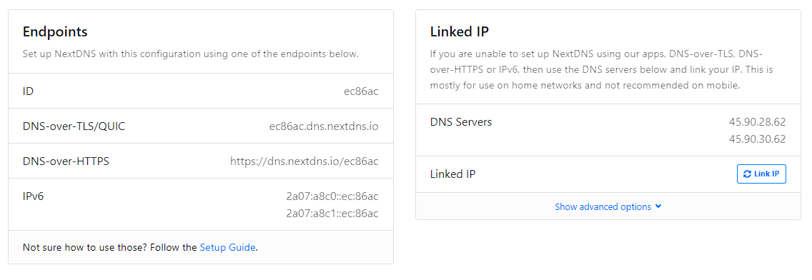
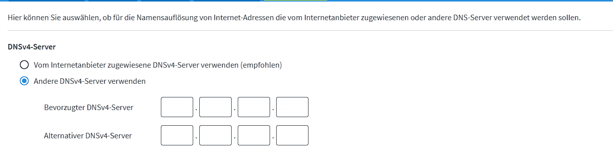
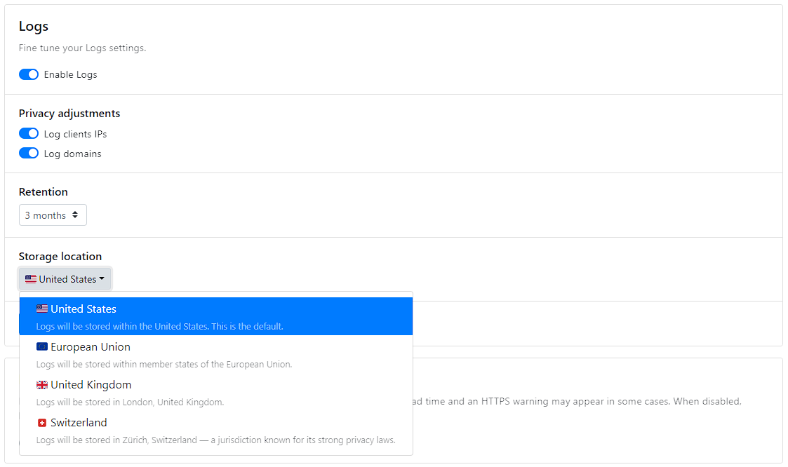
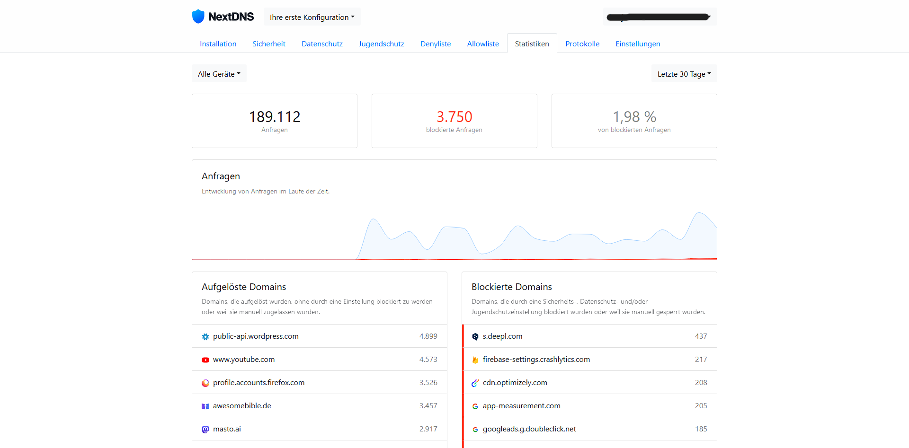
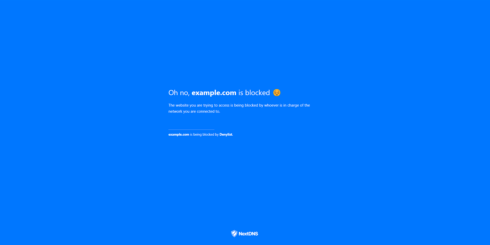
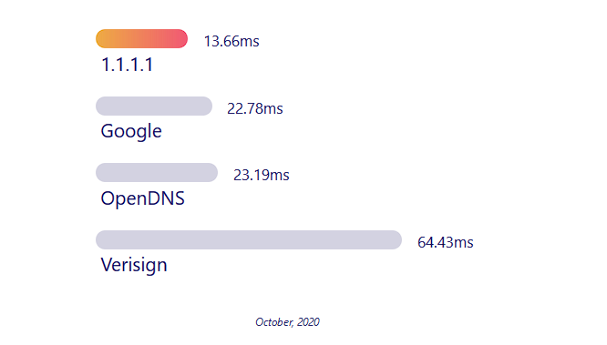
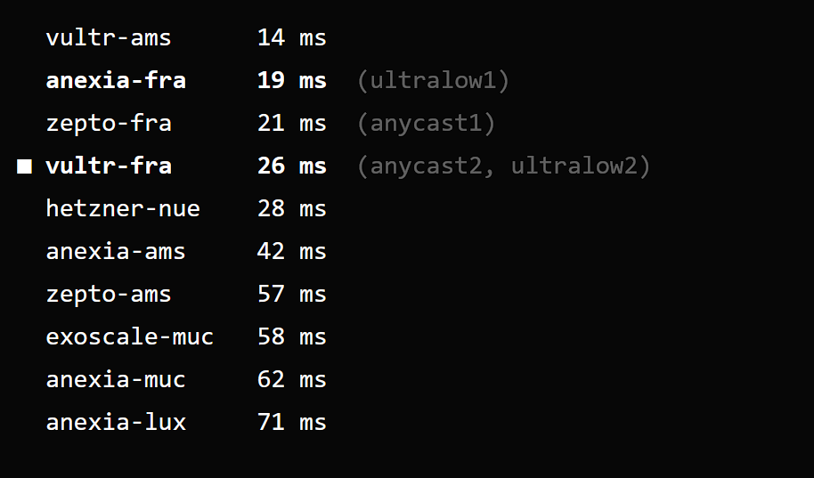

I am a huge fan of network wide adblocking and projects like [Pi-Hole](https://pi-hole.net/) and recently I was looking to change the DNS resolver from our ISP supplied one to a better one (We recently switched ISPs).

Currently I don't have a Raspberry Pi that I could run a Pihole on, but I still wanted the network wide adblocking - so I went with NextDNS.

## What is NextDNS?
NextDNS is an open DNS resolver that gives you the ability to use ad filter lists.

You can use NextDNS as a "normal" DNS Resolver in most Browsers today, but if yo

## How to set up NextDNS

After you sign up, you get a list of IPs you can use on your router and seperate DNS-over-TLS and DNS-over-HTTPS endpoints.

You can either manually enter those in the configurations of your devices - for example, for my FritzBox Router the configuration option is under "Internet" -> "Account Information" -> "DNS Server".

There you can choose to use a different DNS Server to the default and enter in the two IP adresses NextDNS gives you:

Below that you can also choose to enable DNS-over-TLS to encrypt DNS requests.
NextDNS provides you with a DNS-over-TLS endpoint in the form of ``<abc123>.dns.nextdns.io``.

NextDNS also allows you to identify devices in the logs. To use that feature you just modify the endpoint to ``This--Device-abc123.dns.nextdns.io``.

FritzBox allows you to enter multiple DNS-over-TLS endpoints, but for network wide adblocking to function it is important to only have NextDNS configured.
So that in case of a blockage, the Router can't fall back to another DNS provider.

NextDNS also provides configuration samples for dnsmasq, Stubby, pfSense, DNSCrypt, Knot Resolver, Unbound, MikroTik Routers and tailscale.

## NextDNS configuration
The service allows you to use the adlists you know and love from your adblocker (EasyList, Steven Black, Goodbye Ads and many more) but it also offers its own lists and features like Thread-Intelligence-Feeds, AI-based Thread detection and Typosquatting Protection.

They also have the option to enable Anonymized EDNS Client Subnet, a Cache Boost that forces minimal TTLs for requests and CNAME flattening.

NextDNS allows you to configure how long it should keep logs (or if it should at all), and where to store them. They offer 3 different locations for the storage of the logs: the USA, the EU and Switzerland.

If you decide to keep logs, NextDNS will generate a nice overview and summary of what requests have been made, what have been blocked and so on.

If you configured device identification you will also get a rundown of what device made what requests. NextDNS also tells you how many requests have been made to GAFAM companies (Google, Apple, Facebook, Amazon, Micosoft) and what percentage of DNS requests that is.

You can also manually inspect the protocols via the web interface.

Normally, NextDNS answers queries for blocked domains with an "empty" dns response, but you can configure it to redirect to a custom block page:

That is most of NextDNS' features summed up, now for another important part with a DNS resolver:

## Speed
Cloudflare advertises it's DNS resolver as the fastest on the market, intrestingly: it isn't. At least for me.

Cloudflare advertises 1.1.1.1 to be 13 milliseconds fast, but in my experience after doing multiple rounds of tests against both `1.1.1.1` and `one.one.one.one`, I got an average of 52 milliseconds.

That's not that dramatic, but at least a lot slower as advertised. And NextDNS?

For `dns.nextdns.io` and the IP adress that NextDNS gave me, I got an average of 13 milliseconds.

If I test using their own tool - [ping.nextdns.io](https://ping.nextdns.io), I get around 26 milliseconds:

To sum it up, NextDNS is way faster that Cloudflare for me for some reason. 🤔

## Pricing
NextDNS is free for up to 300,000 queries a month and after that only 1,99$ for unlimited queries.
They also offer plans for business and education organizations.

## Privacy
For such a service, privacy is important.
I've read their privacy policy - yep. It's a breath of fresh air in the desert of 300 pages ong legalease privacy policies of other big services.

It's short and to the point.
I'm happy with it.

## Conclusion
If you are looking to set up network wide adblocking - which you should - but you don't have a Raspberry Pi or other device that you could turn into a Pi-Hole, you should definitely try NextDNS.

Also: NextDNS still works if you leave your home and you don't have to do any sysadmin work. Though, if you are reading this you are probably at least a bit familiar with that kind of stuff. (A bit, haha get it).

Okay, I'm gonna leave now... 🫠