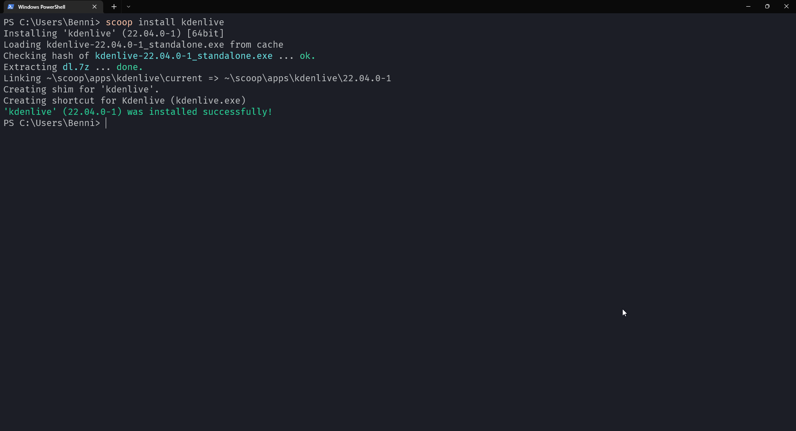

One of the things I miss from Linux when using Windows is the way to install software.

For example, say you would like to install LibreOffice on Windows, it would go something like this:
1. Open your favourite search engine
2. Type in "LibreOffice" and press enter
3. You are presented with a long list of links where you can find LibreOffice, *do you wanna download it from Softonic by any chance*?
4. Find website where you can download the actual file. Click it, accept the User Account Control Prompt and wait while it installs.

Now, enter package management. If you're on Linux, you will most likely be using something like ``apt``, ``dnf`` or ```pacman``.

Installing packages here is easy:
1. Open Terminal
2. Type ``sudo [apt]/[dnf]/[pacman] install libreoffice``. The commands may vary, but usually, they're pretty easy to remember.
3. Enter your password and let it install.

While installing packages on Linux is basically just one command, we here over on Windows-Land have to suffer through malware infested sites that may or may not offer the correct installer.

## It doesn't have to be that way: Enter `scoop` 🍨
[Scoop](https://scoop.sh/) is a PowerShell based package manager. It provides an easy way to install many pieces of software without having to worry about malware or even User Account Control Popups.

You can install it by typing this command to enable scripts from "untrusted" sources:
```powershell
Set-ExecutionPolicy RemoteSigned -Scope CurrentUser
```

And finally executing the install script:
```powershell
Invoke-WebRequest get.scoop.sh | Invoke-Expression
```

### Configuring Buckets
What Repositories are for apt are Buckets for Scoop.

The default *main* bucket only contains command line programs, but it is extremly easy to add new buckets.

Buckets are basically just Git Repositories that contain the instructions to install a certain application.

To add the Extras-Bucket for GUI Applications you just have to type:
```powershell
scoop bucket add extras
```
or, if you wanted to add a specific bucket you have the Git URL to, just type: 
```powershell
scoop bucket add <git url here>
```

There are a plethora of buckets available, from [font collections](https://scoop.sh/#/apps?q=%22https%3A%2F%2Fgithub.com%2Fmatthewjberger%2Fscoop-nerd-fonts%22) to [Java](https://scoop.sh/#/apps?q=%22https%3A%2F%2Fgithub.com%2FScoopInstaller%2FJava%22) or [PHP](https://scoop.sh/#/apps?q=%22https%3A%2F%2Fgithub.com%2FScoopInstaller%2FPHP%22) installers.
### Installing software
Now, installing software couldn't be easier. No more searching for installers or accepting User Account Control Popups.

Just type ``scoop search <package name>`` to see which packages are available and install them by typing ``scoop install <package name>``.



Scoop installs programs in the home directory of the current user, because of that, you don't have to accept UAC Popups.

## Wrapping up
Scoop makes it way easier and safer to install software in windows environments.
But Scoop isn't the only package manager that is available. Some alternatives are [Chocolatey]() which has a greater variety of software by default, but it doesn't circumvent UAC. It also is paid if you want to use it in an enterprise environment.

Of course there is also winget, Microsoft's own package manager, but it doesn't have that many packages available at the time of writing this.

In the end, it doesn't matter what package manager you choose, they all will make your installation experience easier. *And now go install linux.* 😜