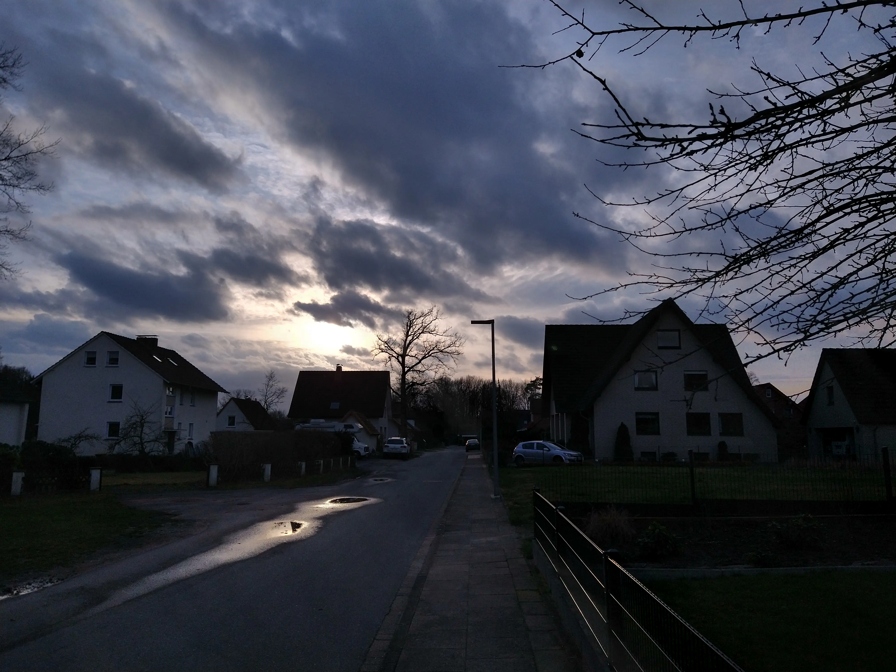
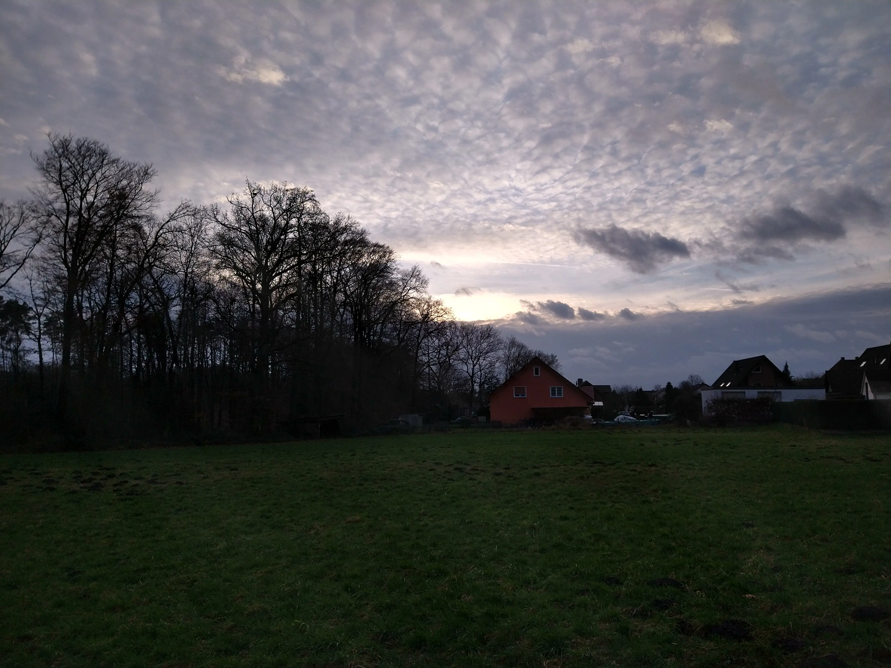

I would describe myself as a pretty happy guy. But lately I had a few very sad days.
Something happened in my family signal group and it just had finished me off.
Suddenly one person in my family no longer wanted to read my messages and I just really felt down.

Normally I take a walk around our neigbourhood every few days but the weather has been bad and I didn't feel I had time for it. After this drama happened in our family group, I decided to go for a walk to clear my mind.

The sun was just setting and it kinda peeked through the cloud ceiling.

This view gives me hope. The big cloud ceiling is overwhelming and depressing, but the sun peeking through it just made me smile. Better times are to come.

The walk was relaxing and it really cleared my mind. I cried, I shouted my feelings out. It helped.

On my way home I saw this cloud formation. For some reason it felt comforting and warm.

For me it looks like a lot of tiny sheep on a meadow. They seem random but are placed carefully by their creator.

I am still sad about the situation and I *want* to resolve it, but at least I know: A sad day also has a place in my life, it was placed carefully by my creator.