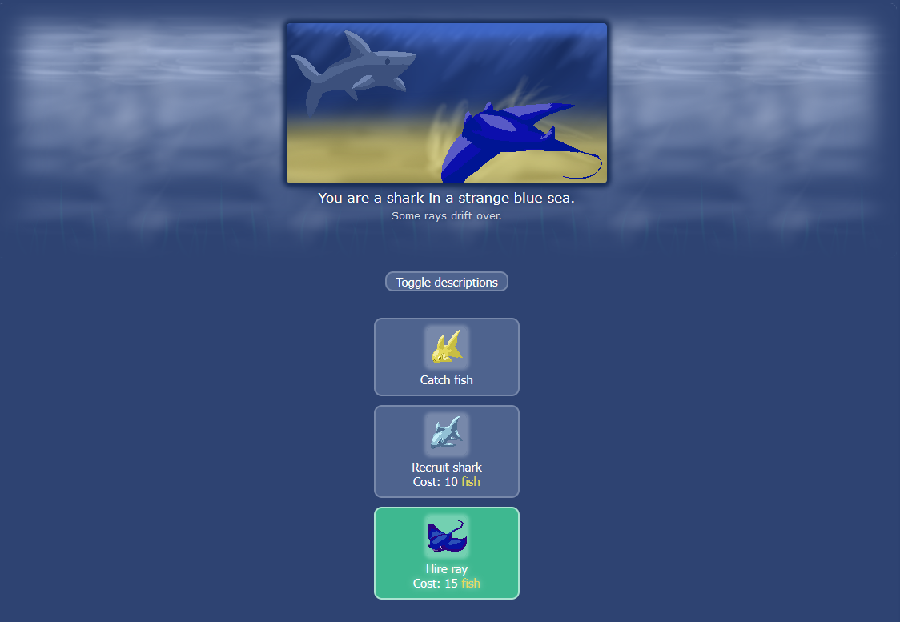

After I paused a few days, I am continuing with `#100DaysToOffload`. Today I want to talk about how my username _darkshark9k_ came to be.

* * *
## "The above variably-named Shark Game"
I used to play a lot of clicker games back in the day. One of them - and by far my favourite is "Fin Idle" or sometimes just "Shark Game".

The reason I write it this way is, the game doesn't have *a* name. Every time you reload the page, the game is named different.

The gameplay is pretty standard for a clicker game. You click to catch fish, if you have enough fish you can recruit sharks to catch for you.

The special thing about this game: There is so much love and care put into the different aspects of the game.
It tells a story, the farther you progress.


The game isn't endless, it has a ending that is (as far as I can remember) really satisfying and beautiful. I can only recommend you play it.

[ -> https://cirri.al/sharks/ ](https://cirri.al/sharks/)

And from that game, I got my username. 
How did you get your's?

Thanks for reading! ♥